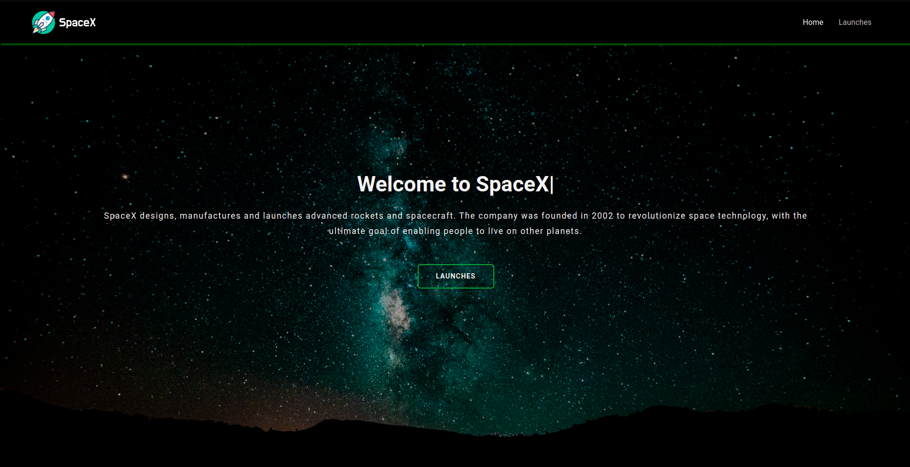
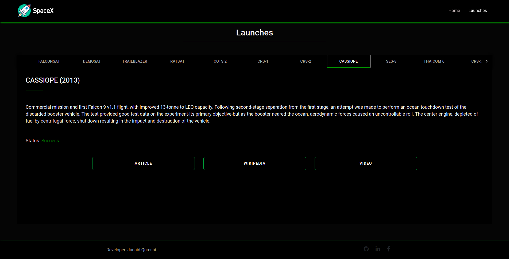
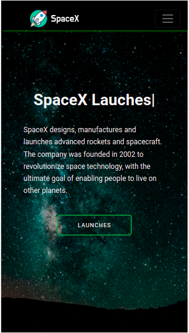

# Space-X Launches - React Website

### On Computer Screen

### On Mobile Screen

### link : https://launches-spacex.web.app/

### Youtube Video (Demo) : https://youtu.be/PFiLdFXXTT4

### _A Website built using ReactJs, Typescript, GraphQl. You can See SpaceX Launches Info here ._

## Features

- Open Source :)
- Secure
- Accessibility Optimized
- Fast
- SEO Optimized
- Mobile Responsive

## Run Locally

- Run this command `git clone https://github.com/developer-junaid/SpaceX-App.git`
- You are now in the dev environment and you can play around

## Tech Stack

- HTML5
- CSS3
- Javascript +ES6
- React Js
- Typescript
- GraphQl
- React Bootstrap
- Material UI
- react-typical
- react-scroll
- Firebase hosting
